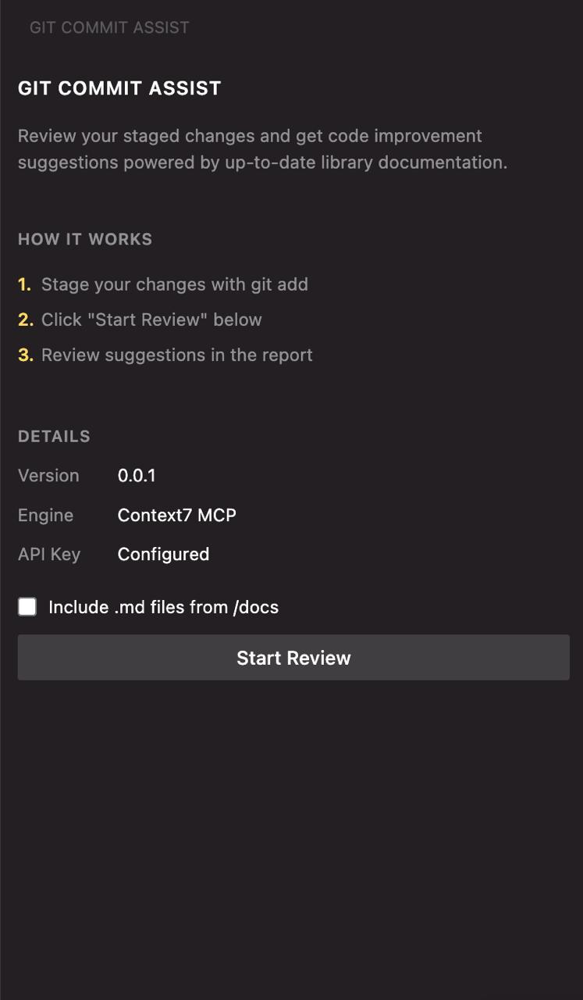
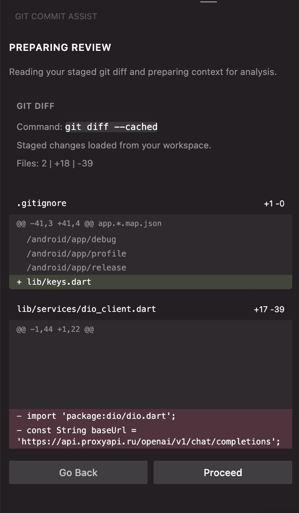
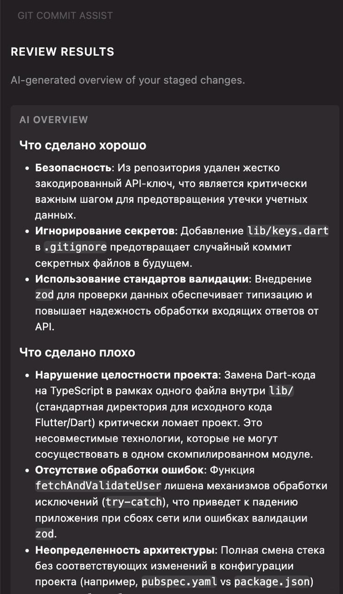

# Git Commit Assist

`Git Commit Assist` is a VS Code extension that analyzes staged Git changes and generates an AI-powered review before you commit.  
It helps catch issues early and gives practical suggestions with documentation context.

## Description

The extension reads your staged diff, detects imported libraries, enriches the review prompt with relevant docs, and returns a structured overview in the sidebar.  
To generate analysis, it uses Gemini and stores your API key securely in VS Code Secret Storage.

## Features

- Analyze staged changes from `git diff --cached`.
- Generate concise AI overview for the current patch.
- Extract third-party imports from diff and fetch related docs.
- Show Context7 usage status and sources in the UI.
- Keep API key in secure storage and allow removing it from extension commands.

## Screenshots

### Home Screen



The home screen shows the extension status before analysis starts: current version, Context7 integration status, API key status, and the optional checkbox for including `.md` files from `/docs`.

### Diff Preview



After clicking **Start Review**, the extension reads `git diff --cached`, summarizes the staged files, and lets you verify the patch before sending it for analysis.

### Review Results



The results screen renders the AI review in markdown and keeps the feedback focused on the staged diff, so you can inspect risks and improvements before creating the commit.

## How It Works

1. Stage the files you want to review with `git add`.
2. Open the **Git Commit Assist** sidebar in VS Code.
3. Click **Start Review** to load the staged diff preview.
4. Confirm the preview with **Proceed**.
5. The extension extracts library references from the diff, optionally loads markdown context from `/docs`, fetches relevant Context7 documentation, and prepares a compact review prompt.
6. Gemini generates the final overview, and the result is displayed in the sidebar.

This flow keeps the review limited to staged changes only, which makes it practical to run right before every commit.

## Example Review Flow

Example:

```bash
git add .gitignore lib/keys.dart lib/services/dio_client.dart
```

In a change like the one shown in the screenshots, the extension can detect that a hardcoded API key was removed, that a secrets file was added to `.gitignore`, and that application code was changed in the same patch. The generated review may then:

- highlight the security improvement of removing a committed secret,
- confirm that ignoring the local secrets file reduces the chance of leaking credentials again,
- warn about architectural or runtime risks in the updated service code,
- point out missing validation or error handling before the commit is finalized.

## Gemini Integration (Short)

`Git Commit Assist` uses Gemini (`gemini-3.1-flash-lite-preview`) to produce code review feedback for staged diffs.  
The extension sends a prepared prompt to Gemini and renders the returned markdown in a webview panel.  
For model interaction, the extension uses the ProxyAPI gateway: [https://proxyapi.ru/](https://proxyapi.ru/).

## Context7 MCP Integration (Short)

The extension integrates with Context7 via the `ctx7` CLI (`npx ctx7 ...`) to resolve library IDs and fetch up-to-date API docs.  
This documentation is injected into the AI prompt so suggestions are grounded in current library usage guidance.

## Local Run

```bash
npm install
npm run compile
```

Press **F5** to launch the Extension Development Host.

## Adding New Features (Code of Conduct)

When adding new functionality, follow these project conventions:

- Keep changes focused and small (one feature per PR when possible).
- Preserve current UX flow in the sidebar and command palette.
- Avoid breaking existing commands: `reviewDiff`, `generateOverview`, and API key actions.
- Prefer clear, testable logic and add/update tests for behavior changes.
- Be respectful in code reviews: constructive comments, no personal remarks, and collaborative tone.

## Contributors

- [@nikzor](https://github.com/nikzor)
  - Project initialization
  - Overview screen
  - Context7 integration
  - Refactoring

- [@1khazipov](https://github.com/1khazipov)
  - Sidebar (initial phase)
  - Analytical flow (prompt / review / results)

- [@notoriousisk](https://github.com/notoriousisk)
  - API key integration + Gemini
  - Diff screen & key status

## License

Licensed under the [MIT License](./LICENSE).
